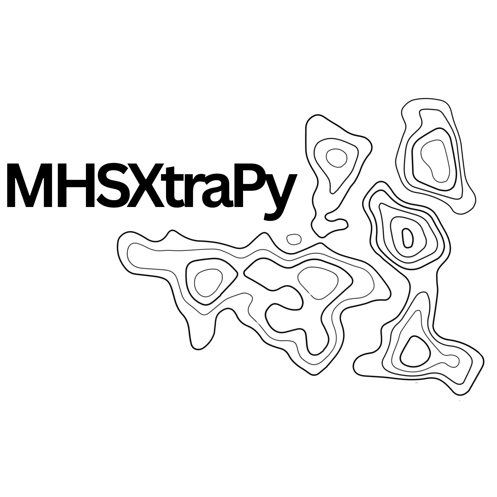

<p align="center">
  <picture>
    <source media="(prefers-color-scheme: light)" srcset="assets/MHSXtraPy-5.png" width="400">
    <source media="(prefers-color-scheme: dark)" srcset="assets/MHSXtraPy-6.png" width="400">
    
  </picture>
</p>

[](https://www.gnu.org/licenses/gpl-3.0)
[](https://www.python.org/downloads/)

MHSXtraPy is a Python code for three-dimensional linear magnetohydrostatic (MHS) extrapolation of photospheric magnetic field observations into the solar corona. Unlike potential-field or force-free extrapolation codes, MHSXtraPy incorporates the non-force-free lower chromosphere and photosphere by solving the MHS equations, providing a model of the solar atmosphere where plasma pressure and gravity effects matter.

## Features

- Three MHS solution families: Low (1991, 1992), Neukirch & Wiegelmann (2019), and Nadol & Neukirch (2025) — selectable via a single enum parameter
- Direct instrument support for SDO/HMI and Solar Orbiter/PHI-HRT magnetograms, with built-in FITS readers and coordinate handling
- Output including the 3D magnetic field vector, current density, Lorentz force, and plasma pressure / density deviations from hydrostatic equilibrium
- Built-in visualisation of magnetograms, 3D field line plots, and height-dependent pressure and density profiles

## Theory

MHSXtraPy solves the linear MHS equations in Cartesian geometry using Fourier decomposition in the horizontal directions and analytical solutions for the vertical structure. The non-force-free to force-free transition is modelled through height-dependent profile functions, allowing a physically consistent representation of the solar atmosphere from the photosphere through the chromosphere into the force-free corona. For a detailed description of the method, see [Nadol & Neukirch (2025)](https://doi.org/10.1007/s11207-025-02469-1) and [Nadol & Neukirch (2025)](https://doi.org/10.1093/rasti/rzaf053).

## Installation

I am using **Python ≥ 3.14**.

Install from source (development mode):

```bash
git clone https://github.com/LMNadol/MHSXtraPy.git
cd MHSXtraPy
pip install -e ".[dev,test]"
```

## Quick Start

```python
import numpy as np

import mhsxtrapy
from mhsxtrapy.examples import multipole
from mhsxtrapy.plotting import plot_field_3d

# 1. Create a boundary condition from an analytical multipole
nx, ny = 200, 200
x = np.linspace(0.0, 2.0, nx)
y = np.linspace(0.0, 2.0, ny)
bz = np.array([[multipole(xi, yi) for xi in x] for yi in y])

data2d = mhsxtrapy.BoundaryData.from_array(bz, pixel_size=0.1, nz=400, pz=0.05)

# 2. Extrapolate
result = mhsxtrapy.extrapolate(data2d, alpha=0.1, a=0.05, which_solution=mhsxtrapy.WhichSolution.LOW, kappa=1.0)


# 3. Visualise
plot_magnetogram(data2d)
plot_field_3d(result, view="los", footpoints="active-regions", pixel_stride_x=10, pixel_stride_y=10)

# 4. Save for later
result.save("results/")
```

## Examples

Example Jupyter notebooks are provided in [`notebooks/`](notebooks/):

| Notebook | Description |
|----------|-------------|
| [example-analytical-bc](notebooks/example-analytical-bc.ipynb) | Analytical multipole boundary condition |
| [example-low-lou](notebooks/example-low-lou.ipynb) | Semi-analytical non-linear force-free boundary (Low & Lou, 1990) |
| [example-sdo](notebooks/example-sdo.ipynb) | SDO/HMI magnetogram as boundary condition |
| [example-solar-orbiter](notebooks/example-solar-orbiter.ipynb) | Solar Orbiter/PHI-HRT magnetogram as boundary condition |
| [paper](notebooks/paper.ipynb) | Reproduces the examples from the RASTI paper |

## Details

### Boundary data

- **`BoundaryData`** — dataclass representing the 2D photospheric boundary condition
  - `BoundaryData.from_array(bz, pixel_size, nz, pz)` — create from a NumPy array
  - `BoundaryData.from_fits(instrument, path, ...)` — load from an SDO/HMI or Solar Orbiter/PHI FITS file
- **`is_flux_balanced(boundary)`** — check whether a magnetogram is flux-balanced
- **`alpha_HS04(boundary)`** — compute optimal α following Hagino & Sakurai (2004)

### Extrapolation

- **`extrapolate(boundary, alpha, a, which_solution, ...)`** → `ExtrapolationResult`
- **`ExtrapolationResult`** — dataclass holding the 3D field and derived quantities
  - Cached properties: `B0`, `PB0`, `BETA0`, `dpressure`, `ddensity`, `j3d`
  - `.save(path)` / `.load(path)` — HDF5 persistence

### Solution types

| Enum value | Description | Reference |
|------------|-------------|-----------|
| `WhichSolution.LOW` | Exponential height profile | Low (1991, 1992) |
| `WhichSolution.NEUKIRCH_WIEGELMANN` | Tanh transition (hypergeometric ODE) | Neukirch & Wiegelmann (2019) |
| `WhichSolution.NADOL_NEUKIRCH` | Asymptotic approximation of N+W (faster) | Nadol & Neukirch (2025) |

### Plotting

- `plot_magnetogram(boundary)` — 2D magnetogram
- `plot_field_3d(result, view, footpoints)` — 3D field line visualisation
- `plot_dpressure_z(result)` / `plot_ddensity_z(result)` — height profiles
- `plot_dpressure_xy(result)` / `plot_ddensity_xy(result)` — horizontal slices

All plotting functions are importable from `mhsxtrapy.plotting`.

## Tests

The test suite uses [pytest](https://docs.pytest.org/) and lives in `tests/`. Install the test dependencies and run:

```bash
pip install -e ".[test]"
python -m pytest tests/test_boundary.py -v
python -m pytest tests/test_fourier.py -v
python -m pytest tests/test_solutions.py -v
```

To run the benchmark suite:

```bash
pytest tests/test_benchmarks.py --benchmark-only
```
